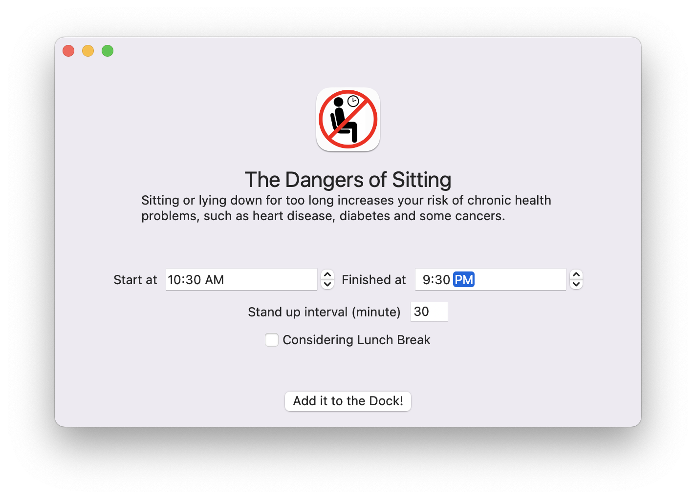
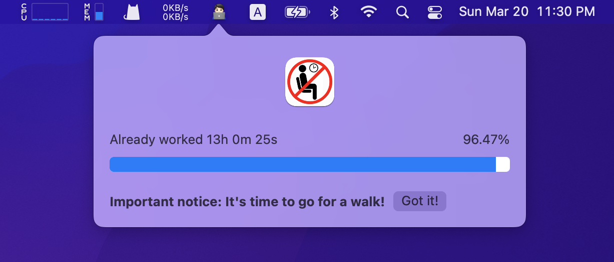

# TheDangersOfSitting

Sitting or lying down for too long increases your risk of chronic health problems, such as heart disease, diabetes and some cancers.

The application's main view.

Popover shows the progress of today's working.

Rest notice will be  shown when the time is coming.

